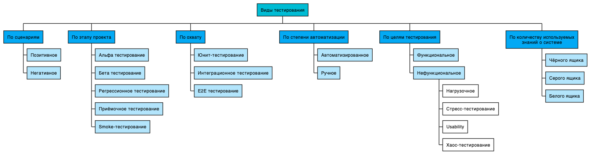
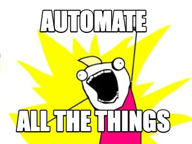

> — *Не кажется ли вам, что термин «юнит-тест» принёс больше вреда, чем пользы индустрии?
> — Я не пользуюсь этим термином.*
>
> Кент Бек на Tech Excellence Conference

Разработчик отвечает за тот код, который пишет. И чтобы код был качественный его необходимо тестировать. Существует огромное множество методики тестирования: функциональное, нефункциональное, нагрузочное, автоматизированное, ручное...

Каким именно тестированием должен заниматься разработчик? Мой ответ — всем. Если не заниматься напрямую, то как минимум понимать, как оно проводится, участвовать в планировании этого тестирования, понимать, что именно там тестируют — всё, чтобы код был готов к соответствующие тестам. Основная цель участия разработчика в планировании тестирования, его разработке и осуществлении — это чтобы разработчик мог при разработке учесть всё то, на что приложение планируется проверить, все наиболее важные аспекты. Это и есть один из аспектов *обеспечения* качества.
## Тесты для разработчика
Но в первую очередь, разработчик должен понимать, как тестировать свой код с точки зрения функциональности. Делает ли код то, что нужно заказчику? Делает ли код то, что нужно самому автору кода? Делает ли код то, что нужно коллегам-разработчикам? И именно о функциональном тестировании мы и будем говорить.

Тестирование бывает ручное и бывает автоматизированное. Мы с вами разработчики и любим писать код — а потому выбор очевиден: автоматизируем всё.

Поэтому будем говорить об авто-тестах. Это вовсе не значит, что не нужно прттыкивать руками функционал, но на практике я прибегу к ручном тестированию только чтобы убедиться, что все элементы правильно были связаны в готовом продукте.

Наконец, тестирование бывает разбито по количеству знаний об устройстве системы — чёрный (ничего не знаем), серый (кое-что знаем) и белый (всё знаем) ящики.. Казалось бы, разработчик не может тестировать черным ящиком, ведь он и есть автор кода. Но разработчик может притвориться, что он ничего не знает. И именно это чаще всего и требуется при написании тестов на готовый код. Либо можно использовать разработку через тестирование — и тут вы буквально тестируете всё черным ящиком: кода, который исполняет требования, ещё нет. О тестировании разных ящиков мы ещё будем говорить отдельно.
## Что тестировать
На тренингах я часто слышу вопрос: «А вот TDD это же только про юнит-тесты?». И обычно я в ответ задаю вопрос: «Что такое юнит-тест?». Логичный ответ, что это тест, который тестирует небольшой юнит кода. Но вот на вопрос: «а что такое юнит?» ответы очень сильно разнятся. А между тем это очень интересный вопрос с точки зрения тестирования: что именно, какие «юниты» должны тестировать юнит-тесты?

Владимир Хориков пишет:
> *Юнит-тестом называется автоматизированный тест, который:
> - проверяет правильность работы небольшого фрагмента кода (также называемого юнитом);
> - делает это быстро
> - и поддерживая изоляцию от другого кода.*
>
> Владимир Хориков, «Принципы юнит-тестирования», «2.1 Определение юнит-теста»

Дальше Владимир рассказывает о «классической» и «лондонской» школах тестирования, которые, как он объясняет, по разному смотрят на понятие изоляции, на третий пункт определения. Лондонская школа тестирует по отдельности каждый класс и мокает зависимости, классическая же сосредотачивается на изоляции самих тестов и их независимости друг от друга.

Получается, лондонская школа чётко даёт определение тому, что является юнитом. Юнитом в таком подходе является отдельный класс, который мы тестируем и зависимости которого мы мокаем.

Классическая (она же «чикагская") школа тестирования столь чёткого определения юнита не даёт. Она не запрещает тестировать сразу несколько классов и их взаимную работу — лишь бы тесты можно было гонять изолировано.

Таким образом, эти школы фактически отличаются и пониманием, что есть юнит кода. Роберт Мартин (дядя Боб), подходящий к тестированию больше со стороны класической школы, в книге «Чистая архитектура» пишет (выделение моё, перевод мой):
> *... у вас должна быть возможность протестировать все **юз-кейсы** без использования фреймворков.*
>
> Роберт Мартин, «Чистая архитектура", глава 21 «Кричащая архитектура", раздел «Тестируемые архитектуры».

Таким образом дядя Боб сводит здесь понятие юнит к юз-кейсу, способу использования. Чтобы чуть полнее проиллюстрировать его подход к тестированию, приведу ещё одну цитату:
> *Вместо использования Тестовых Дублей, я отхожу от микро-тестов, и пишу тесты, которые ближе к функциональным.*
>
> Роберт Мартин, http://blog.cleancoder.com/uncle-bob/2017/05/05/TestDefinitions.html

Мартин также не даёт чёткого определения, что есть юнит, но сам трактует объём покрытия юнит-тестов довольно гибко.

Рой Ошероув в «Искусстве юнит-тестирования» в своём определении юнит-теста отталкивается от понятия unit of work. Его в свою очередь он определяет так:
> *Unit of work — это сумма всех действий, которые происходят между вызовом публичного метода в системе и получением заметного результата тестом этой системы.*
>
> Рой Ошероув, «Искусство юнит-тестирования", цитата по [блогу](https://www.blinkingcaret.com/2016/04/27/what-exactly-is-a-unit-in-unit-testing/) Руи Фигуайредо.

Ошероув оперирует здесь двумя понятиями, которые могут трактоваться по-разному в зависимости от уровня абстракции, который мы обсуждаем — это «система» и «публичный». Например:
1. «Система» — микросервис; её «публичный метод» — метод Web или GRPC API.
2. «Система» — библиотека; «публичный метод» — это метод этой либы, который программист может импортировать в свой код.
3. «Система» — юз-кейс, набор классов; «публичный метод» — метод запуска этого юз-кейса.
4. Наконец, «система» — это отдельный класс; «публичный метод» — любой из его, собственно, публичных методов.

Получается, Ошероув на наиболее низком уровне абстракции говорит о публичных методах класса, хоть и прячет это за более широкое понятие unit of work. Как мы увидели, unit of work может быть и на уровне API метода сервиса. Проще говоря, это определение нас ограничивает лишь в том, чтобы мы не тестировали приватные методы. Это безусловно правильно, но, кажется, больше практических указаний не даёт.

Мне же хочется дать такое определение, которым вы сможете руководствоваться каждый день в своей работе, выбирая, что вы будете тестировать.

Давайте ещё раз вспомним, зачем вам, разработчику, тестировать. Тесты нужны, чтобы убедиться, что приложение продолжит работать так, как вы это задумали. Даже если вы внесёте какие-то изменения в код. Тесты нужны, чтобы вы не боялись вносить изменения. А потому давайте возьмём субъективное, но очень практичное определение того, что нужно покрывать тестами:
> Покрывать тестами нужно любой кусок кода, который может иметь более чем одну точку вызова (публичный) и за будущее которого вам страшно.

- [ ] #task #blog-test обратная связь по определению: Твое определение наверное хорошо подходит. Я с ним согласен. Может поменять «кусок кода» на «часть функциональности приложения»
- [ ] #task #blog-test обратная связь по определению: Так и пиши. Что юнит это достаточно сложный кусок кода который вызывает у вас сомнения в правильности работы )

Странное определение, но именно им я пользуюсь, когда разрабатываю тесты, когда решаю, что требует отдельных тестов, а что можно оставить так. Например, я начинаю с юз-кейса. Написав пару кейсов, я понял, что мне нужен репозиторий. Я добавляю зависимость и дальше должен принять решение: стоит ли покрывать метод репозитория тестами или нет? И ответ на этот вопрос зависит от: страшно ли мне за будущее этого метода в репозитории? Будут ли его переиспользовать? Будут ли его изменять? Если ответы на эти вопросы «скорее да, чем нет", если у метода больше одного способа использования, если у нём присутствует своя логика, то я добавлю в список задач покрытие его нормальными тестами.

